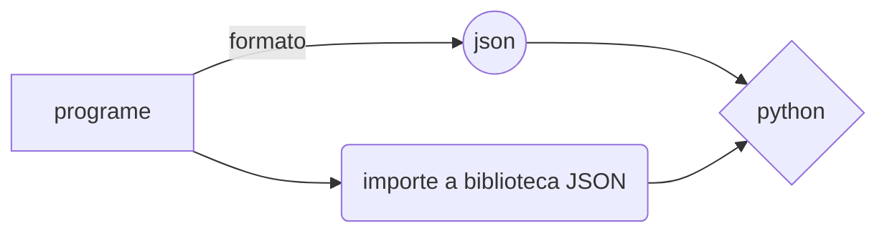

# Arquivos

  

# Leitura e escrita de arquivos.

  

Sabendo que todo algoritmo/programa necessita de três partes necessárias: entrada, sequência de passos e uma saída, a **leitura** e **escrita** de arquivos é a entrada e saída dos dados de um algoritmo e, a escrita a entrada e a leitura a saída.


Para abrir um arquivo em Python usamos a função **open()** que recebe dois parâmetros(ou seja, dois valores): o nome do arquivo a ser aberto e o que queremos fazer com este arquivo, seja escrever ou ler. **!**

  

- **Escrita de dados**

  

Como fazer a escrita em Python?

A escrita de dados pode ocorrer de diversas formas. Sendo elas: por teclado via usuário, linha de comando (cmd) ou cliques em botões ou áreas na tela.

 
Considerando pelo teclado ou seja via usuário, usamos o ```print(“”)``` com aspas duplas entre os parênteses ou simples para solicitar algo.

  

Exemplo.:

```
print(“Digite qual é o seu filme da Disney favorito: ”)

```
Utilizamos **print()** também para mostrarmos a mensagem na tela.

- **Leitura de dados**

  

Para ler dados digitados pelo teclado, utilizamos a função ```input()```e para efetuar a leitura dos dados é necessário ter a seguinte estrutura:
```
input(mensagem: str ) -> str

```

 
**Exemplo.:**

```

input('Digite qual é o seu filme da Disney favorito: ')
filme = input()
print("Seu filme favorito da Disney é, ", filme)

ou também,


print("Digite qual é o seu filme favorito da Disney:")
filme = input()
print("Seu filme favorito da Disney é, ", filme)

```

Resultando em:

````
Digite qual é o seu filme favorito da Disney: //Solicitação
Dumbo //Dado recebido pelo usuário
Seu filme favorito da Disney é, Dumbo //Leitura
````
  
  

A função **input()** sempre lerá strings e caso queira ler um número necessita converter os dados de forma apropriada.

Outra função de leitura de dados é o **readline ()**.

Se caso quer ler dois números inteiros ou arredondados:

**Exemplo.:** 

90 65

Para ser possível ler como inteiro:
```python
import sys

peso, idade = map(int, sys.stdin.readline().split())

```

Tornando cada elemento lido para int.
.
# Método With

O método With é usado na leitura de dados e garante a finalização de recursos como fechar corretamente um arquivo após a utilização.

 ```python
with  open('workfile', encoding="utf-8") as f:

read_data = f.read()
```

#Podendo verificar se foi realmente fechado

```python
f.closed

True
```
 
Caso não utilize o **With** deve utilizar o **método f.close()** para efetuar a finalização correta e evitar erros mesmo após o fechamento ser bem sucedido.


## Gravando dados estruturados em JSON

Json (JavaScript Object Notation) é um formato de informações/dados, independentemente da linguagem de programação.

Sintaxe: É o nome (variável) e o valor que será atribuído para o nome, com um rótulo. Sendo o nome a variável entre aspas, podendo variar o as aspas, quando for valor numérico.

**Exemplo:**
 "estudante": "CTISM"

Neste exemplo estudante é o título e CTISM é o valor. 

Tipos de dados JSON: Numérico, booleano e string.

--> Os objetos (dados) irão estar delimitados por chaves ' { } ' e cada valor será separa por virgula ' , '.

**Exemplo:**
```python
import json
	dados = """{

	"nome:" : "Emanuel",
	"Idade": 19,
	"Ano": 2022,
	"Cidade" : "Santa Maria"

	}"""
	
print(dados)
```
	
**Obs:** Para fazer uma lista de objetos em JSON, basta delimitar por colchetes antes das chaves.

```python	
import json

	
	dados = """{

	"nome:" : "Emanuel",
	"Idade": 19,
	"Ano": 2022,
	"Cidade" : "Santa Maria"

	}"""
	
print(dados)

```


--> Processos de serialização ' json.loads() ' e desserialização ' json.dumps(x, y) ' : São como sinônimos de funções, pois a serialização converte o objetivo no formato JSON, já a desserialização faz o contrário, ou seja, convertendo um formato JSON num objeto (texto).

**Exemplo:** 
```python	
import json
dados = """{
	"nome:" : "Emanuel",
	"Idade": 19,
	"Ano": 2022,
	"Cidade" : "Santa Maria"
	}"""
x= json.loads(dados)  
print(x) 
print(type(x))
conv = json.dumps(x)  
print(conv)
print(type(conv))
```
**Obs:** Referente ao comando 'type()' para verificar o tipo de variável em Python.

**Exercício:** 

No Rio Grande Do Sul, a empresa SEG (Sistema de Ensino Gaúcho) quer correlacionar quanto cada aluno deverá pagar por um curso, pois, devido ao  grande número  de pessoas querendo se matricular no curso de Técnico de Enfermagem, a funcionaria Cláudia se confundiu com os valores de desconto e perdeu a lista com o total de participantes, gerando uma confusão. Com isso, faça uma lista de objetos em JSON com os valores que cada aluno pagará pelo curso. Não erre, como Cláudia!

Luana = 349,50; Pedro = 299,00; Joana = 199,00; Gabriel = 299,00;
João = 300,00; Júlia = 200,00.




**Resolução:**
```python	
import json
	
list = """{
	"Alunos de  enfermagem": 6 
	"Luana": 349,50, 
	"Pedro": 299,00, 
	"Joana": 199,00, 
	"Gabriel" : 299,00,
	"João": 300,00, 
	"Júlia": 200,00
	}"""
	
print(list)
```python	