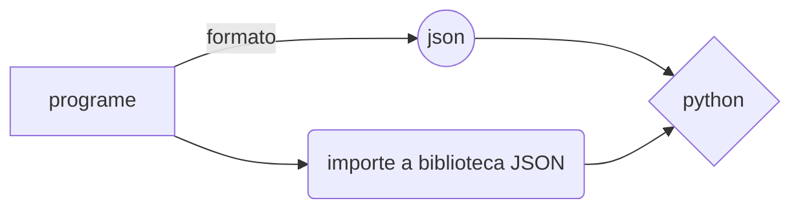

## Gravando dados estruturados em JSON

Json (JavaScript Object Notation) é um formato de informações/dados, independentemente da linguagem de programação.

Sintaxe: É o nome (variável) e o valor que será atribuído para o nome, com um rótulo. Sendo o nome a variável entre aspas, podendo variar o as aspas, quando for valor numérico.

**Exemplo:**
 "estudante": "CTISM"

Neste exemplo estudante é o título e CTISM é o valor. 

Tipos de dados JSON: Numérico, booleano e string.

--> Os objetos (dados) irão estar delimitados por chaves ' { } ' e cada valor será separa por virgula ' , '.

**Exemplo:**
```python
import json
	dados = """{

	"nome:" : "Emanuel",
	"Idade": 19,
	"Ano": 2022,
	"Cidade" : "Santa Maria"

	}"""
	
print(dados)
```
	
**Obs:** Para fazer uma lista de objetos em JSON, basta delimitar por colchetes antes das chaves.

```python	
import json

	
	dados = """{

	"nome:" : "Emanuel",
	"Idade": 19,
	"Ano": 2022,
	"Cidade" : "Santa Maria"

	}"""
	
print(dados)

```


--> Processos de serialização ' json.loads() ' e desserialização ' json.dumps(x, y) ' : São como sinônimos de funções, pois a serialização converte o objetivo no formato JSON, já a desserialização faz o contrário, ou seja, convertendo um formato JSON num objeto (texto).

**Exemplo:** 
```python	
import json
dados = """{
	"nome:" : "Emanuel",
	"Idade": 19,
	"Ano": 2022,
	"Cidade" : "Santa Maria"
	}"""
x= json.loads(dados)  
print(x) 
print(type(x))
conv = json.dumps(x)  
print(conv)
print(type(conv))
```
**Obs:** Referente ao comando 'type()' para verificar o tipo de variável em Python.

**Exercício:** 

No Rio Grande Do Sul, a empresa SEG (Sistema de Ensino Gaúcho) quer correlacionar quanto cada aluno deverá pagar por um curso, pois, devido ao  grande número  de pessoas querendo se matricular no curso de Técnico de Enfermagem, a funcionaria Cláudia se confundiu com os valores de desconto e perdeu a lista com o total de participantes, gerando uma confusão. Com isso, faça uma lista de objetos em JSON com os valores que cada aluno pagará pelo curso. Não erre, como Cláudia!

Luana = 349,50; Pedro = 299,00; Joana = 199,00; Gabriel = 299,00;
João = 300,00; Júlia = 200,00.




**Resolução:**
```python	
import json
	
list = """{
	"Alunos de  enfermagem": 6 
	"Luana": 349,50, 
	"Pedro": 299,00, 
	"Joana": 199,00, 
	"Gabriel" : 299,00,
	"João": 300,00, 
	"Júlia": 200,00
	}"""
	
print(list)
```python	