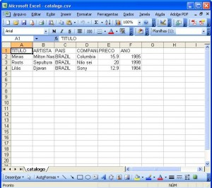
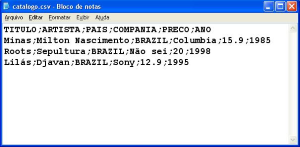

# Biblioteca CSV

Arquivos CSV (comma separated values, ou valores separados por vírgula, na singla em inglẽs) são arquivos comumente
utilizados para tabular informações. 

O formato CSV é utilizado por editores de planilhas, como o Microsoft Excel, Libreoffice Calc, ou então Google 
Spreadsheets, para manipular dados que são expressados em tabelas. Contudo, também é possível manipular tabelas
através da linguagem Python, utilizando a biblioteca nativa csv.

Um arquivo CSV, quando aberto em um editor de planilhas, tem a seguinte aparência:



O mesmo arquivo, quando aberto em um editor de texto, é mostrado com seus valores separados por vírgula:



Perceba que a primeira linha de um arquivo csv é considerada o **cabeçalho**, ou seja, o título das colunas. As colunas
são separadas por vírgula, enquanto as linhas são separadas por uma nova linha de texto.

## Sumário

* do
* it
* later

## Utilizando a biblioteca csv

Para utilizar a biblioteca nativa csv, precisamos fazer uma importação:

```python
import csv
```

A partir disto, podemos usar todas as funcionalidades desta biblioteca.

# Criando um arquivo csv

Para criar um arquivo csv em Python, abrimos um novo arquivo em modo de escrita `w` (do inglês write), 
e o manipulamos com a biblioteca csv:

```python
import csv

with open('arquivo.csv', 'w', newline='') as arquivocsv:
    writer = csv.writer(arquivocsv, delimiter=',') 
    
    # escreve o cabeçalho
    writer.writerow(['Pessoa', 'Beleza'])
    # escreve os dados das linhas
    writer.writerow(['Henry', 'Lindo'])
    writer.writerow(['Ricardo', 'Feio'])
```

## Lendo um arquivo csv

Da mesma maneira que escrevemos um arquivo csv em Python (que pode ser aberto por um editor de planilhas, ou um editor 
de texto como o bloco de notas), podemos ler um arquivo csv que foi criado pelo próprio Python, ou então por outro 
editor:

```python
import csv

with open('arquivo.csv', 'r', newline='') as arquivocsv:
    reader = csv.reader(arquivocsv, delimiter=',')

    for line in reader:
        print(line)
```

A saída deste código será

```
['Pessoa', 'Beleza']
['Henry', 'Lindo']
['Ricardo', 'Feio']
```

## DictReader

Podemos usar a classe DictReader para localizar dados em um arquivo csv:

```python
import csv

with open('arquivo.csv', 'r', newline='') as arquivocsv:
    tabela = csv.DictReader(arquivocsv)

    for linha in tabela:  # itera sobre as linhas
        print("Nome: {0} Beleza: {1}".format(linha['Pessoa'], linha['Beleza']))
```
